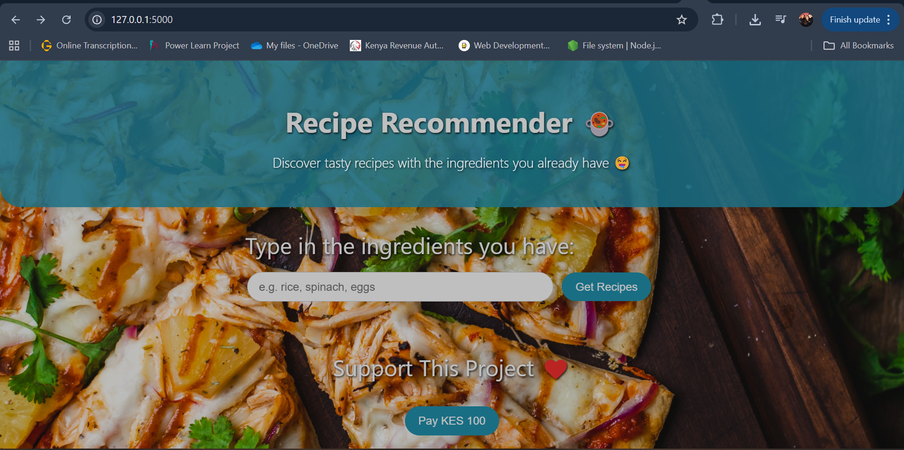
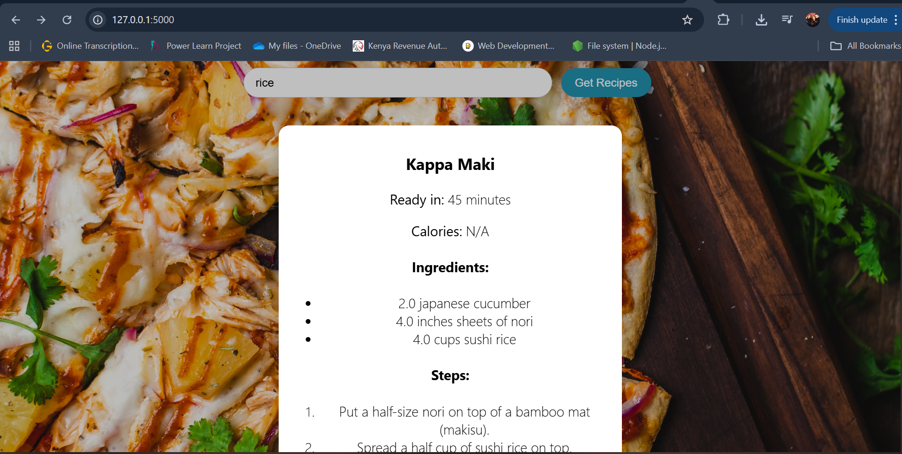

# 🍲 Recipe Recommender

AI-powered recipe recommendation web app that suggests delicious recipes based on ingredients you already have. It integrates **Hugging Face NLP**, **Spoonacular API**, and **MySQL** for storing recipes. Users can also support the project through **IntaSend payments**.

---

## 🚀 Features
- 🔎 **Ingredient-based recipe search** – type in what you have, and get recipes instantly.  
- 🤖 **AI-powered ingredient enrichment** – Hugging Face refines your input for better recipe matches.  
- 🍳 **Detailed recipes** – step-by-step instructions, ingredients list, calories, and cooking time.  
- 💾 **Database storage** – recipes saved into a MySQL database.  
- 💳 **Payments integration** – support the project via IntaSend checkout.  
- 📱 **Responsive design** – optimized for desktop, tablet, and mobile.  

---

## 🛠️ Tech Stack
**Backend:**
- Python (Flask)  
- Hugging Face Inference API (Flan-T5)  
- Spoonacular API (recipes & nutrition)  
- IntaSend API (payments)  
- MySQL (data storage)  

**Frontend:**
- HTML5, CSS3 (responsive with media queries)  
- JavaScript (fetch API, dynamic recipe cards)  

---

## ⚙️ Installation & Setup

### 1️⃣ Clone the repository
```bash
git clone https://github.com/lone-wolffie/Hackathon-2.git
cd Hackathon-2
```

2️⃣ Set up a virtual environment
```bash
python -m venv venv
source venv/bin/activate   # On macOS/Linux
venv\Scripts\activate      # On Windows
```
## run the app
```bash
python app.py
```

## visit
http://127.0.0.1:5000

## Presentation
To see my presentation, click [here] https://www.canva.com/design/DAGx0CueGEs/_vus_JBi0sUrzlMjJ_yH7g/edit?utm_content=DAGx0CueGEs&utm_campaign=designshare&utm_medium=link2&utm_source=sharebutton.

## Homepage



## Recipe Cards



## Contributions
All contributions are welcome! Please feel free to submit a pull request or open an issue for any enhancements or bug fixes.

## License
This project is free to use under the MIT License.
